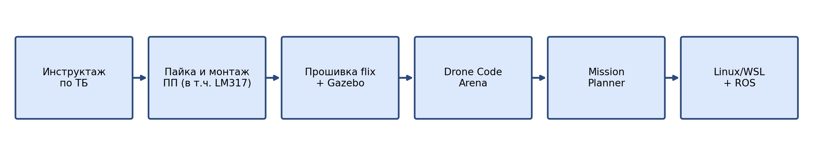
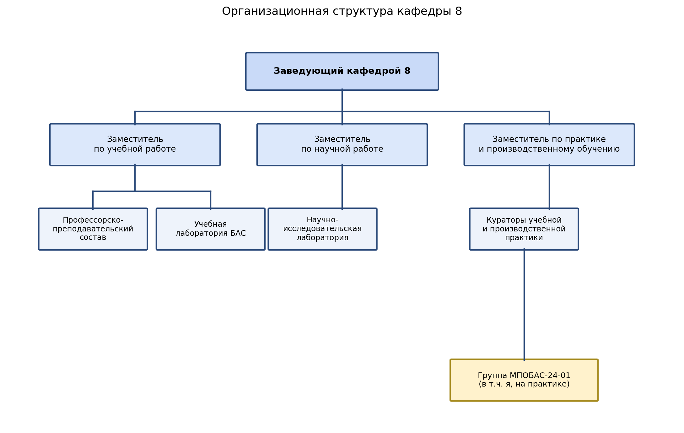

# ОТЧЁТ ПО УЧЕБНОЙ ПРАКТИКЕ

**Кафедра 8. Беспилотные авиационные системы. Группа МПОБАС-24-01**

---

## ВВЕДЕНИЕ

Настоящий отчёт составлен по итогам учебной практики, пройденной с 22 июня по 1 июля 2026 года на базе кафедры 8 (беспилотные авиационные системы), в рамках подготовки студентов группы МПОБАС-24-01 по направлению, связанному с эксплуатацией многоцелевых платформ обеспечения беспилотных авиационных систем (БАС).

За время практики я выполнил полный цикл инженерных задач, характерных для технической эксплуатации БАС: провёл пайку электронных компонентов на печатные платы, включая сборку и настройку регулируемого стабилизатора напряжения на микросхеме LM317; настроил и запустил симулятор полётов Gazebo; скомпилировал прошивку полётного контроллера flix; принял участие в соревновании по планированию маршрутов дрона Drone Code Arena; самостоятельно спланировал полётную миссию в программе Mission Planner; развернул рабочее окружение Linux (WSL) и настроил ROS.

Практика проходила под руководством специалистов кафедры. Дополнительный этап продолжительностью 3 дня запланирован на август 2026 года.

**Рис. 1.** Последовательность этапов практики

---

## 1. ЦЕЛИ И ЗАДАЧИ ПРАКТИКИ

### 1.1. Цели практики

- закрепление навыков работы с технической и эксплуатационной документацией на аппаратно-программные средства объекта;
- закрепление навыков выполнения стандартных инженерных работ под руководством специалиста;
- выполнение работ по технической эксплуатации аппаратно-программных средств объекта;
- участие в техническом обслуживании, профилактическом и текущем ремонте оборудования;
- участие в оперативном контроле технического состояния аппаратно-программных средств.

### 1.2. Задачи практики

- прохождение инструктажа по технике безопасности при работе с электронным оборудованием;
- выполнение пайки и монтажа электронных компонентов на печатную плату;
- чтение и разбор исходного кода полётного контроллера flix;
- компиляция прошивки flix и запуск модели квадрокоптера в симуляторе Gazebo;
- изучение производственного цикла изготовления средств АСУВД (РЭА);
- выполнение задания по планированию маршрута БВС на соревновании Drone Code Arena;
- самостоятельное планирование полётной миссии в программе Mission Planner;
- установка Linux (WSL) и развёртывание среды ROS, ознакомление с лабораторией кафедры.

---

## 2. ОРГАНИЗАЦИОННАЯ СТРУКТУРА КАФЕДРЫ

Практику я проходил в структуре кафедры 8, отвечающей за подготовку специалистов по эксплуатации беспилотных авиационных систем. Кафедрой руководит заведующий, которому подчинены три направления: учебная работа, научная работа и организация практики/производственного обучения. Каждое направление опирается на профильные подразделения — профессорско-преподавательский состав, учебную и научно-исследовательскую лаборатории, а также кураторов практики. Схема ниже показывает эту структуру.

**Рис. 2.** Организационная структура кафедры 8

Моя практика была организована по линии заместителя заведующего кафедрой по практике и производственному обучению: он курирует работу наставников, закреплённых за учебными группами, а непосредственное руководство на местах осуществлял руководитель практики (наставник) от кафедры. Диаграмма ниже показывает моё место в этой цепочке подчинения.

**Рис. 3.** Место практики в структуре подчинения кафедры

Такая организация обеспечила мне доступ к лабораторным стендам, паяльному оборудованию и симуляционным средствам кафедры, а также постоянный контроль качества выполняемых работ со стороны наставника.

---

## 3. ВЫПОЛНЕННЫЕ РАБОТЫ

### 3.1. Инструктаж по технике безопасности

В первый день практики я прошёл обязательный инструктаж по технике безопасности при работе с электрическим и электронным оборудованием. Инструктаж проводился на рабочем месте монтажника: были разобраны правила обращения с паяльником (рабочая температура 300–380 °C, обязательная подставка, вентиляция рабочей зоны), порядок работы с флюсами и припоем ПОС-63 без вдыхания паров, а также правила применения средств индивидуальной защиты.

По итогам инструктажа я расписался в журнале регистрации инструктажей и получил допуск к работе с паяльным оборудованием и лабораторными стендами кафедры.

### 3.2. Радиомонтаж: пайка электронных компонентов

На следующий день я приступил к практическому радиомонтажу. Задание состояло в сборке и пайке набора электронных компонентов на учебную печатную плату (ПП). Работу я выполнил в следующей последовательности:

- подготовил рабочее место: закрепил плату в держателе, подготовил паяльник и флюс;
- выполнил лужение контактных площадок платы — нанёс тонкий слой припоя для улучшения адгезии;
- установил и запаял резисторы (типоразмер 0805) — фиксировал компоненты пинцетом, закреплял каплей припоя с одной стороны, затем пропаивал с обеих сторон;
- установил и запаял конденсаторы и разъёмы;
- провёл визуальный контроль качества паяных соединений: проверил отсутствие «холодной пайки», перемычек между дорожками и непропаев.

В ходе работы я освоил дозирование припоя, научился распознавать дефекты пайки и устранять их с помощью оплётки для удаления припоя. Собранную плату проверил наставник, после чего она была допущена к следующему этапу монтажа. Полученный навык пайки напрямую применим при техническом обслуживании бортового радиоэлектронного оборудования БВС.

### 3.3. Подключение платы LM317: описание и таблица деталей

Одним из практических заданий радиомонтажного этапа была сборка регулируемого стабилизатора напряжения на микросхеме LM317.

**Что такое LM317 и что она делает.** LM317 — это трёхвыводная интегральная микросхема линейного регулируемого стабилизатора напряжения положительной полярности. В отличие от нерегулируемых стабилизаторов (типа 78xx) с фиксированным выходным напряжением, LM317 позволяет плавно задавать выходное напряжение в диапазоне примерно от 1,25 В до 37 В с помощью всего двух внешних резисторов. Микросхема поддерживает выходной ток до 1,5 А и имеет встроенную защиту от перегрузки по току и от перегрева, что исключает выход схемы из строя при коротком замыкании нагрузки или превышении допустимой рассеиваемой мощности. Внутри LM317 сравнивает напряжение между выводами OUT и ADJ с внутренним опорным напряжением 1,25 В и подстраивает ток через проходной транзистор так, чтобы это соотношение сохранялось постоянным — именно на этом принципе строится вся схема регулировки. На печатной плате я использовал LM317 для получения стабильного регулируемого напряжения питания лабораторного стенда, что позволяет запитывать различные модули без риска подать на них завышенное напряжение.

Фотография собранной мной платы с LM317 приведена ниже.

![https://github.com/pupsik0053-dot/Ot4et_KAMAL/blob/main/foto_raboty_1.jpg]
**Рис. 4.** Фотография собранной платы со стабилизатором напряжения на LM317

*(вставьте сюда свою фотографию: сохраните её рядом с этим файлом otchet_praktika.md под именем* `lm317.png` *— или, если файл в формате JPG, замените в строке выше `lm317.png` на* `lm317.jpg`*)*

Ниже приведён перечень компонентов схемы и их назначение.

| Компонент | Обозначение | Функция в схеме |
|---|---|---|
| Микросхема LM317 | U1 | Регулируемый линейный стабилизатор напряжения; поддерживает разницу между выводами OUT и ADJ на уровне 1,25 В, за счёт чего формируется стабильное выходное напряжение. |
| Резистор задающий | R1 (240 Ом) | Задаёт опорный ток через вывод ADJ; совместно с R2 определяет итоговое выходное напряжение по формуле Vout = 1,25 В × (1 + R2 / R1). |
| Подстроечный резистор | R2 (потенциометр) | Изменяет коэффициент делителя обратной связи, позволяя плавно регулировать выходное напряжение в рабочем диапазоне стабилизатора. |
| Входной конденсатор | Cin, 0,1 мкФ | Подавляет высокочастотные пульсации и наводки на входе, повышает устойчивость схемы при удалении от источника питания. |
| Выходной конденсатор | Cout, 1 мкФ | Сглаживает выходное напряжение и уменьшает переходные выбросы при скачках нагрузки. |
| Клеммы Vin / Vout / GND | — | Точки подключения источника питания, нагрузки и общего провода схемы. |

#### Описание схемы подключения

Входное напряжение подаётся на вывод IN микросхемы LM317. Между выводом IN и общим проводом (GND) установлен входной конденсатор Cin, подавляющий высокочастотные помехи источника питания и повышающий устойчивость схемы.

Вывод OUT является выходом стабилизированного напряжения; между ним и GND включён выходной конденсатор Cout, сглаживающий напряжение при изменениях нагрузки. Между выводом ADJ и GND установлен резистор R1, а между выводами OUT и ADJ включён подстроечный резистор (потенциометр) R2 — вместе они образуют делитель напряжения обратной связи, определяющий итоговое значение Vout по формуле Vout = 1,25 В × (1 + R2 / R1).

Изменяя сопротивление R2, я регулировал выходное напряжение в рабочем диапазоне стабилизатора, контролируя результат мультиметром. Такая схема включения — стандартное решение для получения регулируемого стабильного напряжения питания на макетных платах и в бортовых модулях БАС.

### 3.4. Разбор исходного кода flix. Первый запуск симуляции

На следующем этапе я перешёл к работе с полётным контроллером flix. Я изучил структуру исходного кода прошивки: модули инициализации периферии, контуры стабилизации (PID-регуляторы по углам и угловым скоростям) и логику обработки телеметрии. Далее я собрал прошивку из исходников, устранив несколько ошибок конфигурации сборочного окружения, и загрузил её в связку с моделью квадрокоптера в симуляторе Gazebo.

Первый запуск позволил мне проверить корректность работы контуров стабилизации на модели без риска повредить реальное оборудование: я наблюдал реакцию модели на управляющие команды, подбирал параметры регуляторов и убедился в стабильном зависании модели в симуляции.

### 3.5. Соревнование Drone Code Arena

В рамках практики я принял участие в соревновании Drone Code Arena, посвящённом планированию маршрутов беспилотных воздушных судов. Задание заключалось в построении оптимального маршрута облёта заданных точек с учётом ограничений по времени и препятствий на местности. Я разработал и протестировал алгоритм построения маршрута, что позволило закрепить практические навыки маршрутного планирования, применимые при подготовке реальных полётных заданий.

### 3.6. Планирование полётной миссии в Mission Planner

Самостоятельно я спланировал полётную миссию в программе Mission Planner: задал точки маршрута (waypoints), высоту и скорость пролёта каждого участка, настроил параметры автоматического взлёта и посадки, а также проверил миссию на соответствие лётным ограничениям. Эта работа дала мне практическое понимание процесса подготовки полётного задания для автопилота ArduPilot.

### 3.7. Установка Linux (WSL) и развёртывание ROS

На заключительном этапе я установил дистрибутив Linux в среде WSL и развернул на нём ROS (Robot Operating System). Я настроил рабочее пространство (workspace), проверил взаимодействие узлов (nodes) через топики и ознакомился с лабораторией кафедры, где эти инструменты используются для разработки и отладки бортового программного обеспечения БАС.

---

## ЗАКЛЮЧЕНИЕ

За время учебной практики я выполнил все поставленные задачи и закрепил практические навыки, необходимые инженеру по эксплуатации беспилотных авиационных систем.

Что конкретно я сделал за время практики:

- прошёл инструктаж по технике безопасности и получил допуск к паяльному оборудованию и лабораторным стендам кафедры;
- выполнил пайку и монтаж электронных компонентов на печатную плату, освоив дозирование припоя и контроль качества паяных соединений;
- собрал и настроил регулируемый стабилизатор напряжения на микросхеме LM317, разобрался в назначении каждого компонента схемы (R1, R2, Cin, Cout) и в принципе её работы;
- изучил исходный код полётного контроллера flix, скомпилировал прошивку и запустил модель квадрокоптера в симуляторе Gazebo;
- принял участие в соревновании Drone Code Arena по планированию маршрутов БВС;
- самостоятельно спланировал полётную миссию в программе Mission Planner;
- установил Linux (WSL) и развернул среду ROS, ознакомился с лабораторией кафедры;
- разобрался в организационной структуре кафедры 8 и в месте практики в цепочке её подчинения — от заведующего кафедрой до наставника, курировавшего мою работу (см. Рис. 2 и Рис. 3).

Составленные в ходе практики схемы — последовательность этапов практики (Рис. 1), организационная структура кафедры (Рис. 2) и цепочка подчинения на практике (Рис. 3) — наглядно отражают как техническую, так и организационную стороны пройденной практики. Полученный опыт формирует прочную базу для дальнейшей практики и последующей профессиональной деятельности в области БАС.
